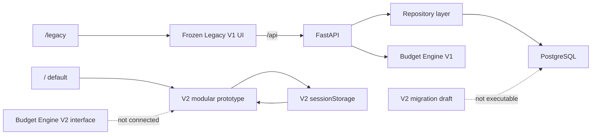

# HomeBudget AI 系统架构

版本：`v0.1.0-alpha.1`

## 系统边界

## 前端

- `src/App.tsx` 只负责默认 V2 与 `/legacy` 冻结入口组合。
- `src/pages` 和 `src/components` 保存冻结的 Legacy V1 UI。
- `src/features/v2Planner` 是独立 V2 功能边界。
- V2 的 12 个品类模块分别位于 `modules/<moduleName>`。
- V2 使用独立 `sessionStorage`，不写入正式数据库。
- `/v2/planner/basic`、`modules` 和 `preview` 保持直接访问兼容。

## 后端

- `app/api/routes`：HTTP 路由和错误映射。
- `app/schemas/v2`：按 common、requirements、rooms、items、pricing、plans
  拆分的 V2 契约。
- `app/models_v2.py`：旧导入路径的兼容层。
- `app/services/budget_engine.py`：V1 工作流编排。
- `budget_scoring.py`、`budget_allocation.py`、`budget_reporting.py`：
  V1 评分、守恒分配和解释输出。
- `app/repositories`：数据库读取和方案快照持久化。
- `app/domain/procurement_rules.py`：模块化 V2 规则统一加载器。

## 数据

- 正式 V1 迁移：`backend/alembic/versions`。
- V2 未批准迁移：`backend/alembic/drafts`。
- V1 规则种子：`backend/data/budget_rules.json`。
- V2 37 条规则原始评审稿：
  `backend/data/procurement_rules_v1.draft.json`。
- V2 模块规则与 manifest：`backend/data/procurement_rules`。

模块化规则加载测试会验证 37 条规则与原始评审稿在字段、值和顺序上
完全一致。

## 安全与网络

- 数据库连接只从 `DATABASE_URL` 读取。
- 本地数据库预期只监听 localhost。
- 前端通过 Vite `/api` 代理访问本地 FastAPI，不需要开放 CORS。
- V2 不连接大模型、商品接口、云数据库或外部用户系统。
