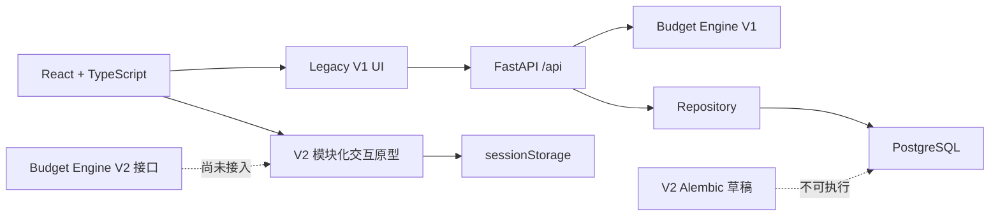

# GitHub Alpha 发布前审计报告

> 状态更新（2026-07-30）：本报告保留发布授权前的审计快照。产品所有者
> 随后已批准 Apache-2.0 并授权正式发布；当前状态以
> [v0.1.0-alpha.1 发布报告](release-v0.1.0-alpha.1.md)为准。

版本：`v0.1.0-alpha.1`
审计日期：2026-07-30
项目：HomeBudget AI / 住算

## 1. 审计范围

本次审计覆盖 Git 状态、目录与依赖、前后端代码、V1 预算引擎、V2
交互原型、37 条 V2 采购规则、配置与本地启动脚本、PostgreSQL 只读状态、
文档、GitHub CI、敏感信息、浏览器回归和发布阻塞项。

本次没有开发新产品功能，没有接入 Budget Engine V2、AI、MCP、商品接口
或云服务，没有执行 Alembic 迁移，没有修改数据库，也没有创建远程仓库、
提交、标签、Release 或推送。

## 2. 审计前基线

| 项目 | 基线结果 |
| --- | --- |
| Git 分支 | `main` |
| Git 历史 | `No commits yet on main` |
| 已跟踪文件 | 0 |
| Git 状态 | 项目文件全部未跟踪 |
| Python | 3.12.10 |
| Node.js | 22.11.0 |
| npm | 10.9.0 |
| 后端测试 | 16 passed / 2.22s |
| 前端 typecheck | 通过 |
| 前端生产构建 | 通过，81 modules |
| V1/V2 服务 | 基线时均未启动，URL 不可达 |
| PostgreSQL | `postgresql-x64-18`，Running / Automatic |
| Alembic code head | `20260728_0002 (head)` |
| Alembic DB current | `20260728_0002 (head)` |

基线只查询了 Alembic 状态，未执行迁移。

## 3. 当前架构图



后端 V2 契约已按 `common / requirements / rooms / items / plans / pricing`
拆分，并由 `models_v2.py` 提供兼容导入；V1 引擎按编排、评分、分配、报告、
类型和常量拆分。前端 V2 的 12 个模块各有独立目录，公共编辑器不包含具体
品类规则。

## 4. 最大文件列表

完整 132 个代码文件及行数见
[code-size-inventory.md](code-size-inventory.md)。

| 行数 | 文件 | 说明 |
| ---: | --- | --- |
| 325 | `backend/alembic/drafts/20260729_0003_phase6a_v2_schema.py` | 迁移草稿例外 |
| 252 | `frontend/src/pages/ResultPage.module.css` | 未超过强制线 |
| 235 | `frontend/src/features/v2Planner/pages/BasicInfoPage.tsx` | 已拆分内部职责 |
| 231 | `frontend/src/pages/HomePage.module.css` | 未超过强制线 |
| 226 | `frontend/src/features/v2Planner/modules/shared/ModuleEditor.tsx` | 已拆分区块函数 |
| 212 | `frontend/src/pages/PlannerPage.module.css` | 未超过强制线 |
| 201 | `backend/tests/test_budget_engine.py` | 测试文件 |
| 196 | `backend/alembic/versions/20260728_0001_initial_schema.py` | 正式迁移例外 |
| 189 | `backend/tests/test_v2_design_contracts.py` | 测试文件 |
| 173 | `backend/app/services/budget_scoring.py` | 单一评分职责 |
| 168 | `frontend/src/features/v2Planner/modules/shared/ModuleEditor.module.css` | 未超过强制线 |
| 165 | `frontend/src/features/v2Planner/pages/BasicInfoPage.module.css` | 未超过强制线 |
| 160 | `scripts/start-dev.ps1` | 安全启动检查 |
| 157 | `frontend/src/pages/result/ResultSections.tsx` | Legacy 结果区块 |
| 149 | `frontend/src/features/v2Planner/pages/PreviewPage.module.css` | 未超过强制线 |
| 148 | `frontend/src/features/v2Planner/pages/PreviewPage.tsx` | 已拆分区块函数 |
| 143 | `backend/app/db/models.py` | V1 ORM 模型 |
| 134 | `frontend/src/features/v2Planner/state/transitions.ts` | V2 纯状态转换 |
| 129 | `backend/app/repositories/budget_repository.py` | 单一仓储职责 |
| 127 | `backend/scripts/recover_and_bootstrap_local_postgres.ps1` | 本机恢复脚本，已忽略 |

结论：无 TS/TSX 业务文件超过 350 行，无 Python 业务文件超过 450 行，
无 CSS Module 超过 350 行；普通业务函数无超过 80 行者。迁移文件中的
长函数属于允许例外。

## 5. 拆分前后对比

| 对象 | 拆分前 | 拆分后 |
| --- | --- | --- |
| V1 `budget_engine.py` | 499 行万能 service | 106 行编排器 + scoring/allocation/reporting/rules/types |
| `models_v2.py` | 348 行集中契约 | 54 行兼容层 + 6 个职责 schema 文件 |
| Legacy `PlannerPage.tsx` | 290 行步骤页 | 66 行组合页 + 3 个步骤组件 + flow hook + types |
| V2 `catalog.ts` | 12 模块集中定义 | 28 行目录 + 每模块独立 `definition.ts` |
| V2 状态 Hook | 单 Hook 132 行 | 40 行 Hook + 纯 `state/transitions.ts` |
| Legacy 结果页 | 153 行单函数 | 57 行页面组合 + `ResultSections.tsx` |
| 37 条采购规则 | 单一大型 JSON | 原稿保留 + 11 品类 JSON + manifest + loader |
| 前端长函数 | 6 个超过 80 行 | 0 个超过 80 行，最长 73 行 |

37 条规则的原始字段、值和顺序均未改变；测试对模块加载结果和原始聚合
JSON 做完全相等断言。

## 6. 重构文件列表

后端主要重构：

- `backend/app/services/budget_engine.py`
- `budget_engine_types.py`、`budget_engine_rules.py`
- `budget_scoring.py`、`budget_allocation.py`、`budget_reporting.py`
- `backend/app/schemas/v2/{common,requirements,rooms,items,plans,pricing}.py`
- `backend/app/models_v2.py`
- `backend/app/domain/procurement_rules.py`
- `backend/data/procurement_rules/manifest.json` 和 11 个品类 JSON
- `backend/scripts/split_procurement_rules.py`
- `backend/tests/test_v2_design_contracts.py`

前端主要重构：

- `frontend/src/pages/PlannerPage.tsx` 与 `pages/planner/*`
- `frontend/src/pages/ResultPage.tsx` 与 `pages/result/ResultSections.tsx`
- `frontend/src/features/v2Planner/modules/catalog.ts`
- 12 个 V2 模块目录中的 `definition.ts` 和组件
- `modules/shared/options.ts`、`modules/shared/ModuleEditor.tsx`
- `hooks/useV2Planner.ts`、`state/transitions.ts`
- `pages/BasicInfoPage.tsx`、`pages/PreviewPage.tsx`
- `pages/HomePage.tsx`

工程配置：

- `backend/requirements-dev.txt`、`backend/pyproject.toml`
- `frontend/eslint.config.js`、`.prettierrc.json`、`.prettierignore`
- 前后端依赖声明及锁文件
- `scripts/start-dev.ps1`、`scripts/stop-dev.ps1`

## 7. 删除或废弃文件

- 已删除未被引用的 `frontend/src/features/v2Planner/modules/generic/GenericModule.tsx`。
- 旧版 Legacy 页面、V1 引擎、V1 数据和历史迁移全部保留。
- 聚合规则原稿 `procurement_rules_v1.draft.json` 保留作审阅基线。
- 两份包含本机绝对路径、仅用于历史 PostgreSQL 恢复的 PowerShell 脚本
  未从用户磁盘删除，但已在 `.gitignore` 中隔离。
- 5 张未被文档引用、内容为旧 UI 的本地截图未删除，但已隔离，不进入
  公开仓库候选文件。

## 8. 重复代码处理

- V2 下拉枚举选项集中到 `modules/shared/options.ts`。
- 12 个模块复用无品类知识的 `ModuleEditor`，具体规则留在各模块定义。
- V2 状态写入集中为纯 transition，Hook 只负责 React 生命周期和动作暴露。
- V1 评分、守恒分配和输出解释不再重复穿插在编排器中。
- 未发现重复导出的同名 TypeScript 业务类型。
- 自定义导入图扫描：66 个 TS/TSX 文件 0 个循环；34 个 Python 应用模块
  0 个循环。

未发现需要继续删除的高置信度未使用组件、Hook 或 Python 应用模块。
`budget_engine_v2.py` 是明确未接入的设计接口，不是运行时入口。

## 9. 格式化和 lint 结果

前端：

- TypeScript `strict: true`
- ESLint：通过，0 warning
- Prettier：通过
- `npm run lint`：通过
- `npm run typecheck`：通过

后端：

- Ruff lint：通过
- Ruff format check：39 files formatted
- mypy：34 source files，0 issue
- import 顺序由 Ruff 统一

所有工具均为项目级依赖；未全局安装或修改系统配置。

## 10. 后端测试结果

- `pytest -q`：17 passed / 1.45s
- Python `compileall`：通过
- V1 五类预算场景、API、预算守恒、上下限和偏好影响均通过
- V2 schema、37 条规则、manifest 加载和原始值完全一致测试通过
- 测试使用内存 SQLite，不连接或写入本机开发数据库

## 11. 前端测试和构建结果

- ESLint + Prettier：通过
- TypeScript strict：通过
- Vite 6.4.3 生产构建：通过
- 101 modules transformed
- JS：199.37 kB / gzip 64.05 kB
- CSS：27.62 kB / gzip 5.91 kB

浏览器真实回归：

- Legacy 首页和三步问卷入口：通过
- V2 基础信息页：通过
- V2 12 模块工作台：通过
- 家具、厨房家电、影音娱乐三个模块：通过
- “不看电视”联动排除电视：通过
- V2 预算预览：通过
- 刷新和 `sessionStorage` 3/12 进度恢复：通过
- 应用控制台 error：0

## 12. 安全扫描结果

- Python `pip-audit`：0 个已知漏洞
- npm 官方 registry audit：0 个漏洞
- `pip check`：无损坏依赖
- `npm ls --all`：依赖树可解析；平台可选依赖未安装属正常
- lockfile 下载地址已统一为官方 `registry.npmjs.org`
- 未发现 API key、token、私钥、真实测试账户或认证备份
- `.env`、日志、PID、数据库、备份、SQL dump、证书、IDE 文件已忽略
- `.env.example` 仅有 `change-me` 占位符
- Docker PostgreSQL 端口限制为 `127.0.0.1:5432`
- Vite 和 Uvicorn 启动地址限制为 `127.0.0.1`
- 未启用 debug/reload；未发现错误堆栈主动返回逻辑
- 当前未配置 CORS；本地前端使用同源 `/api` 代理，因此不需要开放 CORS

## 13. 秘密与隐私风险

真实 `.env` 存在于本机，但确认被 Git 忽略；报告未读取或输出秘密值。
本机 PostgreSQL 数据库未纳入仓库，也没有导出、备份或上传。文本扫描未
发现邮箱、手机号、真实用户数据文件或私钥。

剩余风险：正式公开前仍应由仓库所有者在暂存预览中再次核对所有 PNG、
文档和历史脚本；本次已将未引用旧截图与本机恢复脚本排除在候选文件外。

## 14. Git 仓库清洁结果

`.gitignore` 已覆盖 Python、Node、构建、环境、日志、PID、数据库、备份、
凭据、IDE、OS 和本机恢复文件。`.env.example` 明确保留。

关键阻塞：当前仓库 **0 个已跟踪文件、0 个提交**。因此没有“已跟踪但
不应提交”的文件，但也没有可发布的 Git 快照。此状态必须由产品所有者在
审阅后创建首个提交；本阶段按要求未执行该操作。

## 15. README 与文档完成情况

已准备：

- `README.md`、`README.en.md`
- `CHANGELOG.md`、`CONTRIBUTING.md`、`SECURITY.md`
- `.env.example`、`.editorconfig`、`.gitattributes`
- `docs/architecture.md`
- `docs/development.md`
- `docs/product-scope.md`
- `docs/known-limitations.md`
- `docs/code-size-inventory.md`
- 本审计报告

README 已明确 Alpha、V2 主线、Legacy 冻结、V2 引擎未接入、原型估算、
产品边界、中国大陆市场、安装、环境变量、数据库、启动、测试、V2 地址、
限制和路线图。

## 16. CI 配置情况

`.github/workflows/ci.yml` 已配置：

- 后端：安装 dev 依赖、Ruff、格式检查、mypy、pip-audit、pytest
- 前端：`npm ci`、lint、typecheck、build
- 最小 `contents: read` 权限
- 不读取本机 PostgreSQL 密码，不连接开发数据库

Issue、Bug、Feature 和 Pull Request 模板已准备。YAML 共 5 个文件全部
通过本地解析，但因尚无远程仓库，GitHub Actions 尚未实际运行。

## 17. 从干净环境运行的验证结果

锁文件、项目级依赖清单、通用手动命令和相对路径脚本均已准备。一键启动
实测成功，健康检查和 Vite 页面可访问；一键停止实测只停止记录并校验的
Uvicorn/Vite PID，8000/5173 监听归零，PostgreSQL 保持 Running /
Automatic。

`npm ci --dry-run --ignore-scripts` 已通过官方 registry 验证前端锁文件可用于
干净安装；未删除现有 `node_modules`。

只读数据库核对：

- Alembic head/current：`20260728_0002 (head)`
- 表：`alembic_version`、`budget_items`、`budget_plans`、
  `city_factors`、`user_requirements`、`users`
- `budget_items`：27
- `city_factors`：13

没有删除本地依赖目录来模拟全新克隆。由于 Git 当前没有任何已跟踪文件，
无法从“干净 clone”完成最终复现，这也是发布 P0。

## 18. 当前未解决问题

1. Git 尚无首个提交，所有候选发布文件均未跟踪。
2. （审计时）开源许可证尚未由产品所有者确定；后续已批准 Apache-2.0。
3. CI 尚未在 GitHub 执行。
4. 浏览器回归仍是人工流程，没有仓库内自动化 E2E。
5. CI 没有 PostgreSQL 集成测试，仅使用内存 SQLite。
6. Budget Engine V2、V2 数据库迁移和正式价格校准按产品范围仍未接入。
7. 可访问性、性能与生产安全认证未完成。

## 19. P0 / P1 / P2 问题分级

P0：

- 0 个 Git 跟踪文件 / 0 个提交，无法形成可发布快照。
- （审计时）缺少产品所有者批准的开源许可证；后续已解决。

P1：

- GitHub CI 尚未实际运行。
- 无自动化浏览器 E2E。
- 无 CI PostgreSQL 集成测试。

P2：

- V2 价格、城市因子仍为原型/草稿数据。
- 可访问性和性能未做生产级认证。
- 依赖更新尚未自动化。
- 本机历史恢复脚本仍保留在磁盘，但已从候选发布文件隔离。

## 20. GitHub 发布就绪评分

**78 / 100**

代码质量、模块边界、测试、构建、依赖安全和文档已达到 Alpha 预览候选
水平；审计时主要扣分来自仓库没有任何跟踪快照、许可证未确认、CI 未实际运行和
自动化 E2E/数据库集成测试缺失。

## 21. 明确结论

**NO-GO**

这是“发布操作”层面的 NO-GO，不是功能回归失败。代码候选已通过本地
质量门禁，但在当时产品所有者确认许可证并创建、审阅首个 Git 提交之前，不应
创建 GitHub 仓库或发布 `v0.1.0-alpha.1`。

## 22. 发布前仍需产品所有者确认

1. ~~选择并批准开源许可证。~~ 后续已完成：Apache-2.0。
2. 确认仓库名称、所有权、可见性和对外联系渠道。
3. 审阅首个暂存文件清单，确认忽略项没有误入。
4. 确认 V2 Alpha 产品边界及“原型估算、不是报价”的公开表述。
5. 确认 37 条采购规则可以作为 draft 随 Alpha 公开。
6. 确认 V2 Alembic 草稿继续保留在不可执行目录。
7. 决定是否永久删除本机历史恢复脚本和旧 UI 截图。
8. 首次提交后在 GitHub 运行 CI，并依据结果作最终 GO/NO-GO。

## 23. 完整 Git diff 摘要

`git diff` 和 `git diff --stat` 为空，因为仓库从未有首个提交，Git 无法
计算与基线的 tracked diff。报告生成后，候选发布集合约为 187 个未跟踪、
未忽略文件；顶层包括：

```text
.editorconfig
.env.example
.gitattributes
.github/
.gitignore
CHANGELOG.md
CONTRIBUTING.md
README.en.md
README.md
SECURITY.md
backend/
compose.yaml
docs/
frontend/
scripts/
```

按扩展名主要为 Python 43、TSX 36、TypeScript 31、JSON 22、CSS 17、
Markdown 18、YAML 5 和 PowerShell 2。真实 `.env`、`.venv`、
`node_modules`、`dist`、运行日志、PID、5 张旧截图和两份本机恢复脚本均
不在候选集合中。

本阶段已按要求暂停在本地审计完成状态，未执行任何 Git 提交、推送、标签、
Release 或远程仓库操作。

## 审计后状态更新

- 2026-07-30，产品所有者批准 Apache-2.0 并授权首次公开 Alpha 发布。
- 根目录已加入官方完整 `LICENSE`，许可证阻塞已解决。
- 本节以上的 NO-GO、候选数量和未解决项保留为审计时点证据，不代表后续
  发布流程的最终状态。
- 后续状态见 [v0.1.0-alpha.1 发布报告](release-v0.1.0-alpha.1.md)。
