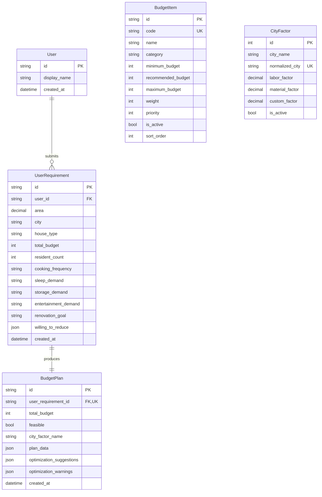
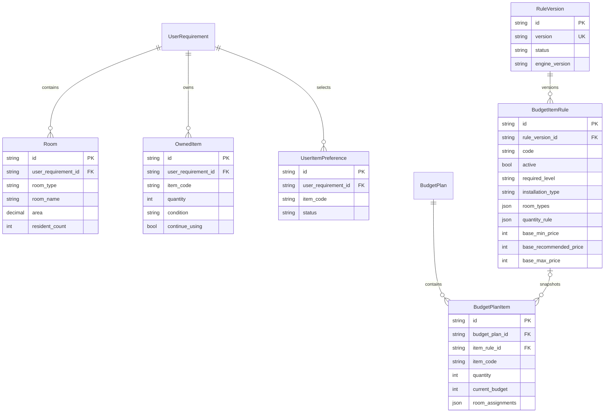

# 数据库设计

> 前四节记录当前已部署的 V1 数据库。Phase 6A 的 V2 结构是并行扩展，不重命名或删除这些历史表。

## 1. ER 图

## 2. 表说明

### `users`

V1 没有登录系统。每次计算创建匿名用户记录，为未来账户合并保留稳定主体。

### `budget_items`

保存预算规则。金额单位为人民币元，使用整数避免浮点误差。分类元数据冗余在项目行中，便于在不增加分类表的情况下维持现有分类 API。

### `city_factors`

- `labor_factor`：人工相关工程系数
- `material_factor`：材料、家具和家电系数
- `custom_factor`：全屋定制系数

`normalized_city="*"` 是全国默认行。系数采用 `NUMERIC(6,3)`。

### `user_requirements`

保存计算时的输入快照。枚举以字符串保存，使产品枚举扩展不依赖数据库枚举迁移。

### `budget_plans`

保存单一方案快照。`plan_data` 保存完整项目数组，保证预算规则更新后历史结果不变。V1 读规则时仍使用规范化的 `budget_items` 表。

## 3. 索引与约束

- `budget_items.code` 唯一
- `city_factors.normalized_city` 唯一
- `budget_plans.user_requirement_id` 唯一
- 所有金额字段非空，业务层校验 `minimum <= recommended <= maximum`
- 外键删除使用数据库默认限制，避免误删历史方案

## 4. 初始化与迁移

1. `alembic upgrade head` 创建结构，并通过第二个迁移写入预算项目和静态城市系数。
2. `python -m app.db.seed` 用于部署后的幂等同步或规则更新。
3. Seed 使用 code/normalized_city 幂等更新，可重复执行。

## 5. Phase 6A V2 迁移草案

迁移草案 `backend/alembic/drafts/20260729_0003_phase6a_v2_schema.py` 设计以下并行结构。审核前不放入正式 versions 目录：

`city_factors` 增加 product/delivery/installation/service 四类系数；旧三类系数保留。`user_requirements` 和 `budget_plans` 只增加可空兼容字段，历史记录不回填伪造值。

迁移当前仅为评审草案，尚未应用到本机 PostgreSQL。详细迁移顺序和回滚策略见 `docs/phase-6a-design.md`。
