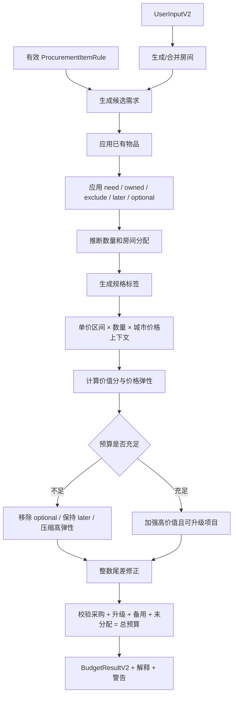

# Phase 6A 设计评审与第二批交互原型

状态：`prototype`
规则版本：`home_setup_v1_draft_1`
引擎接口版本：`2.0-design`

## 1. V2 产品边界

V2 只规划用户可以购买、配送、搬入或进行简单/有限专业安装的家居项目。硬装施工和强现场依赖系统不进入有效采购清单。Legacy V1 已冻结并仅用于历史兼容。

| 包含 | 暂不包含 |
|---|---|
| 可移动家具、成品收纳家具 | 水电、防水、泥瓦、墙面、吊顶、地板施工 |
| 普通分体空调和独立家电 | 中央空调、地暖、新风 |
| 窗帘、成品灯具、床品 | 全屋定制柜体和固定收纳 |
| 入住收纳用品、小家电基础包 | 强依赖柜体或现场改造的嵌入式家电 |
| 无线/简单安装智能设备 | 装修公司报价、施工人工、必须测量后报价的固定系统 |
| 装饰画、靠垫、地毯、绿植 | 任何装修依赖型项目 |

旧硬装数据继续保留在 `budget_items` 和历史方案快照中。V2 使用独立 `budget_item_rules` 规则目录；切换时将全部旧规则复制为 inactive，硬装规则永远不得 active。规则草案中的 `legacy_catalog_policy` 明确列出了硬装编码。当前第一批不修改旧表数据，不执行切换。

### 预算模式 C（已确认）

- `ceiling` 为默认模式：总预算是上限，允许保留结余。
- `full_allocation` 只能把结余分配到用户选定升级、品质升级模块或备用资金。
- 禁止为花满预算平均提高所有项目金额。

```text
allocated_budget + upgrade_budget + reserve_budget + unallocated_budget
    = total_budget
```

第二批前端采用“5 项基础信息 → 模块工作台 → 按需填写 → 临时预览”，不再实施大型五步问卷。

## 2. 新旧数据模型差异

| 维度 | 旧 V1 | 新 V2 |
|---|---|---|
| 输入 | 面积、城市、户型、人数、4 个偏好、总预算 | 首次 5 项基础信息；其余成员、房间、偏好和已有物品在模块内渐进采集 |
| 房间 | 无结构化房间 | `Room`，支持系统生成后调整 |
| 已有物品 | 无 | `OwnedItem`，包含数量、状态、是否继续使用 |
| 项目选择 | 只有全局偏好 | 每项目 `need/owned/exclude/later/optional` |
| 规则 | 固定金额上下限、权重、优先级 | 安装类型、适用房间、数量规则、单价区间、7 类价值分、版本 |
| 城市价格 | 人工/材料/定制 | 商品/配送/安装/服务；旧三类保留 |
| 结果 | 一个金额项目列表 | budget_mode、采购/升级/备用/未分配金额、数量、规格、房间、状态和安装说明 |
| 引擎 | 固定项目调权分配 | 需求识别 → 排除 → 数量规格 → 区间 → 价值优化 |
| 版本 | 无独立规则版本表 | `rule_versions` + `rule_version` + `engine_version` |

Pydantic 评审契约位于 `backend/app/models_v2.py`。它与现有 `app/models.py` 并行，不改变当前路由。

## 3. 数据库迁移设计

迁移草案：`backend/alembic/drafts/20260729_0003_phase6a_v2_schema.py`。它有完整 upgrade/downgrade，但刻意不放入 `alembic/versions`，因此日常 `alembic upgrade head` 不会误应用。本批不执行数据库迁移。

### 新表

- `rule_versions`：规则版本及 draft/active/retired 状态。
- `budget_item_rules`：V2 采购规则，不复用旧 `budget_items`，避免旧 API 在切换前失效。
- `rooms`：一次需求中的房间快照。
- `owned_items`：已有物品快照。
- `user_item_preferences`：用户对单项目的明确选择。
- `budget_plan_items`：规范化保存 V2 结果项目，同时保留 `budget_plans.plan_data` 历史快照。

### 扩展字段

- `city_factors`：增加商品、配送、安装、服务四类系数。
- `user_requirements`：增加房间数、家庭构成、用途/年限和新增偏好。
- `budget_plans`：增加已分配/未分配、城市上下文、规则和引擎版本。

### 历史兼容

- 新增的需求和方案字段对历史记录允许 `NULL`。
- 旧 `budget_items`、旧城市系数和旧方案 JSON 不删除、不改名。
- `budget_plan_items.item_rule_id` 允许 `NULL`，保证规则退休后历史行仍可读取。
- 迁移 `downgrade()` 会按反向依赖顺序删除新表和新列，不删除旧数据。

### 建议上线顺序

1. 产品确认本评审稿。
2. 校准规则价格和争议字段。
3. 将审核后的 0003 移入 `alembic/versions`，在测试数据库执行并验证 downgrade。
4. 导入一个 `draft` 规则版本；硬装规则 active=false。
5. 实现并影子运行 V2 API，不切换前端。
6. 10 场景审核通过后激活规则版本。
7. 切换前端；旧 API 和旧引擎保留一个回滚周期。

## 4. 家具、家电、软装项目清单

规则文件：`backend/data/procurement_rules_v1.draft.json`，共 37 项。

| 类别 | 项目 |
|---|---|
| 家具（12） | 床架、床垫、沙发、餐桌椅、茶几、书桌、书桌椅、床头柜、成品衣柜、鞋柜、儿童家具、独立收纳家具 |
| 家电（12） | 普通分体空调、冰箱、洗衣机、烘干机、电视、扫地机器人、净水器、独立式洗碗机、普通油烟机、普通燃气灶、普通热水器、小家电基础包 |
| 软装及入住（8） | 窗帘、灯具、床品、地毯、装饰画、靠垫、绿植、入住收纳用品 |
| 智能设备（5） | 智能门锁、路由器、智能音箱、智能照明设备、基础传感器 |

## 5. 必要性和安装类型

| 项目 | 必要性 | 安装 |
|---|---|---|
| 床架、床垫 | essential | simple / none |
| 沙发、餐桌椅、书桌、书桌椅、成品衣柜、鞋柜、儿童家具 | recommended | simple |
| 茶几、床头柜、独立收纳家具 | optional | none/simple |
| 冰箱 | essential | none |
| 洗衣机 | essential | simple |
| 普通油烟机、普通燃气灶、普通热水器 | essential | professional |
| 普通分体空调、净水器 | recommended | professional |
| 烘干机、电视、扫地机器人、独立式洗碗机 | optional | none/simple/professional |
| 小家电基础包 | recommended | none |
| 窗帘、灯具 | essential | professional（仅成品安装，不含改造） |
| 床品 | essential | none |
| 入住收纳用品 | recommended | none |
| 地毯、装饰画、靠垫、绿植 | optional | none/simple |
| 路由器 | essential | simple |
| 智能门锁 | recommended | professional |
| 智能音箱、智能照明设备、基础传感器 | optional | none/simple |

所有 `renovation_dependent` 项目必须 inactive。本版草案没有 active 的装修依赖项目。

## 6. 数量与规格推断规则

### 通用顺序

1. 由房间计数生成默认房间。
2. 合并用户调整后的房间。
3. 计算规则候选数量。
4. 扣减 `continue_using=true` 的已有数量。
5. 应用项目明确状态；`owned/exclude/later` 当前数量和预算为 0。
6. 将数量限制在规则最小/最大值内。
7. 根据房间面积、人数和偏好生成规格标签。

### 核心项目

- 分体空调：每个高频使用且需要温控的客厅/卧室/书房最多 1 台；按房间面积输出 1匹、1.5匹或2匹标签；扣减已有空调。
- 床架/床垫：按实际使用的睡眠房间和人数生成床位；儿童房生成单人/成长型标签；床垫数量跟随床架；睡眠、静音需求影响等级。
- 餐桌椅：家中用餐时生成 1 套；座位不低于常住人数；每日做饭可预留 1-2 个临时座位；小户型优先折叠/伸缩标签。
- 冰箱：默认每户 1 台；1 人 200-300L、2-3 人 300-450L、4 人以上 450L+；每日做饭或高收纳需求上调容量。
- 洗衣机：默认每户 1 台；1-2 人 8-10kg、3 人以上 10-12kg；儿童家庭增加除菌标签；已有继续使用时为 0。
- 烘干机：明确 need 时生成；自动推断仍缺晾晒条件和烘干需求字段，因此当前只作为可选项。
- 窗帘：每个有外窗的常用房间 1 套；卧室按睡眠需求输出遮光等级。
- 灯具：每个有效房间 1 个基础灯具预算单位；只计算成品灯具和简单安装。
- 路由器：小户型 1 台；面积和房间数量较大时输出 2-3 节点 Mesh 标签，不计算弱电施工。

## 7. Budget Engine V2 流程



建议价值分维度为频率、健康、舒适、寿命、能效、更换困难和家庭共享价值；价格弹性单独用于削减顺序。具体系数第一批不定稿。

## 8. 10 组测试场景

完整输入位于 `backend/tests/fixtures/v2_scenarios.json`。

| ID | 场景 | 核心断言 |
|---|---|---|
| S01 | 一室一厅单人，已有电视冰箱 | 两项 owned 且预算 0 |
| S02 | 两室夫妻，重睡眠做饭 | 保护床垫、床架与厨房核心家电 |
| S03 | 三室三口，有儿童高收纳 | 生成儿童家具并提高收纳数量 |
| S04 | 三室出租，耐用低预算 | 价值品牌优先，装饰/智能排除 |
| S05 | 四室多人，高空调洗衣需求 | 至少 5 台空调候选，洗烘大容量 |
| S06 | 明确不看电视 | 电视 exclude 且预算 0 |
| S07 | 已有洗衣机 | 洗衣机 owned 且预算 0 |
| S08 | 烘干机以后再买 | dryer later 且预算 0 |
| S09 | 低预算 | 装饰和非必要智能先于 essentials 移除 |
| S10 | 标准 28 万上限 | `allocated <= 280000`，四类金额合计严格等于 280000 |

每个场景必须输出统一明细表：项目编码、名称、状态、数量、规格、推荐区间、当前预算、房间分配和解释。第一批只有输入与断言定义，实际金额明细需等 V2 引擎实现后生成，不能使用伪造结果。

## 9. 需要产品经理确认的争议项

1. `brand_preference` 草案枚举是否采用 no_preference/value/balanced/premium。
2. 是否新增远程办公/学习人数，用于稳定判断书桌和书桌椅数量。
3. 是否新增晾晒条件、洗衣频率和烘干需求，用于判断烘干机。
4. 是否新增燃气/电磁烹饪方式，避免默认生成燃气灶。
5. 是否新增热水能源和“住宅已配热水系统”，避免重复生成热水器。
6. 窗帘、灯具、门锁的 professional 安装费是否计入项目预算还是单独分类。
7. 出租房是否默认包含基础电视、空调和小家电，还是完全由房东选择。
8. `full_allocation` 中重点升级项目与品质升级模块的选择界面和最高升级额度。
9. `replace_soon + continue_using=true` 应视为当前 owned、later，还是本次 need。
10. 静态单价和四类城市系数的校准来源、更新频率与审核责任人。

## 10. 风险和下一步建议

- 最大产品风险：输入字段不足会让燃气灶、热水器、烘干机、书桌等需求判断不可靠。
- 最大算法风险：`full_allocation` 必须严格限制结余去向，不能退化为平均加价。
- 最大数据风险：草案价格未经市场校准，不能直接面向用户。
- 最大迁移风险：若在 V2 API 上线前停用旧规则，会破坏当前 V1；因此迁移和切换必须分阶段。
- 最大体验风险：37 项逐项选择过重，Step 4 应使用高频项目快捷卡片和“稍后细调”。

第二批交互原型已经采用预算模式 C，并通过独立 `/v2` 路由落地。下一步应先由产品实际体验模块划分、填写负担和状态语义；确认后再实现规则加载、数量/规格推断、分配算法、持久化与影子 API。
