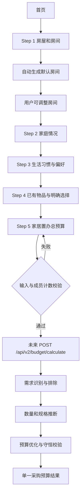

# V2 目标用户流程（Phase 6A 设计）

> 当前 React 页面仍运行旧三步流程。本文件描述产品审核通过后才实施的五步目标流程。

结果页展示分类汇总、数量、规格、价格区间、当前分配、原因、城市价格说明，以及已有/排除/延后项目。结果页不得展示硬装项目、理想方案或增加预算建议。

V2 API 路径尚未定稿，当前 `/api/budget/calculate` 和旧页面保持不变。
